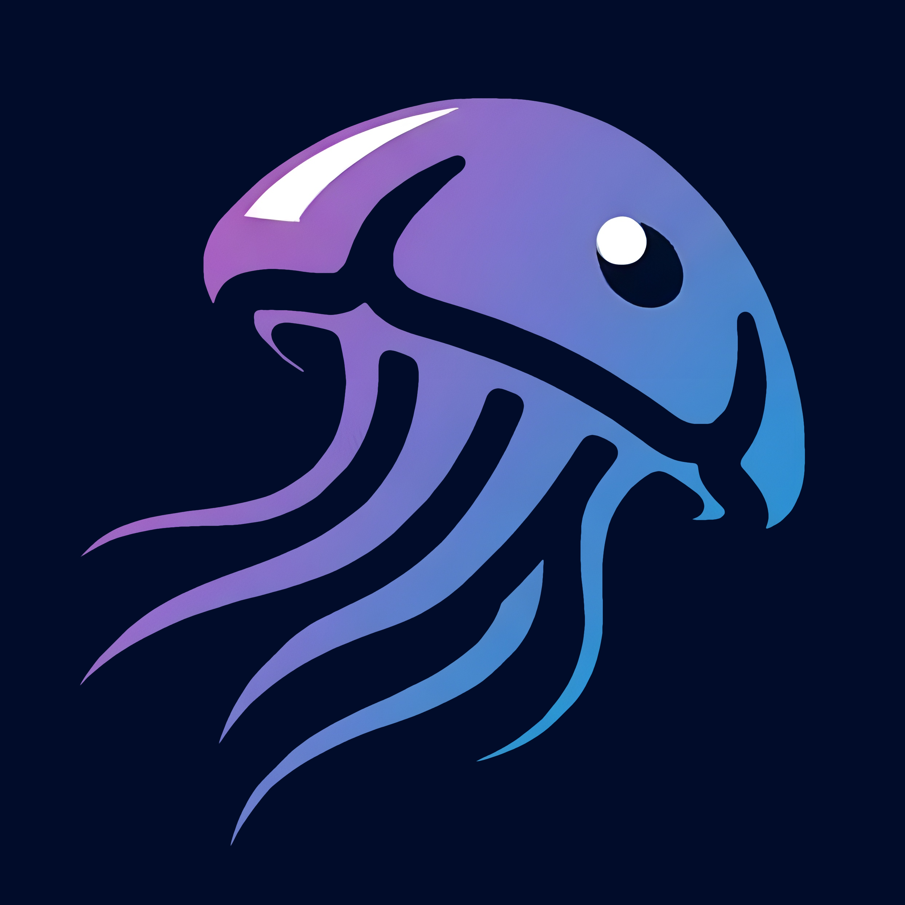

# Jellyfish

Jellyfish is a cross-platform media player for Jellyfin. It is built with [SvelteKit](https://kit.svelte.dev/) and [Tauri](https://tauri.app/).

## Development

To run the app in development mode, run the following commands:

Mobile:
```bash
npm run tauri
```

Desktop:
```bash
npm run dev
```
